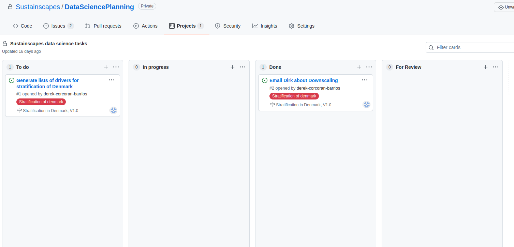
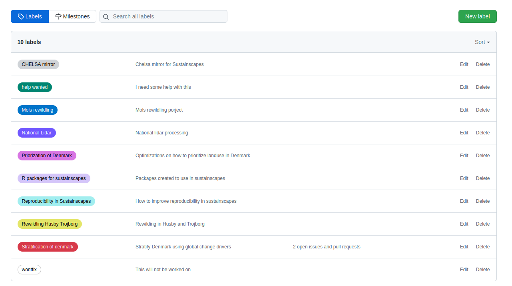
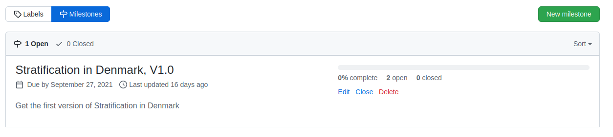
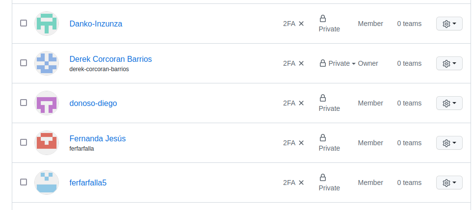

```{r setup, include=FALSE}
knitr::opts_chunk$set(echo = FALSE, warning = FALSE, message = FALSE, cache = FALSE, tidy = TRUE, tidy.opts = list(width.cutoff = 50))
library(tidyverse)
library(knitr)
library(kableExtra)
options("kableExtra.html.bsTable" = T)
```

# What is it

## What you can do

- Free
- Task Management
- Have roles (Owner, administrator, user)
- Generate teams
- Manage privacy of repositories
- Have a free webpage
- GitHub Actions (Check Packages automate running scripts)

# Task management

## Task management

* Can be as manual or automated as wanted.
* Will always receive an email notification
* People form the organization can be tagged.
* On public projects it can be triggered by someone creating an issue

```{r}

```

## Task management

* Personalized [tags](https://github.com/Sustainscapes/DataSciencePlanning/labels)

```{r}

```

## Task management

* [Milestones](https://github.com/Sustainscapes/DataSciencePlanning/milestones) with due dates

```{r}

```

# Roles

## Roles

* Owner (Invite, generate teams, Generate templates, change privacy of repository, generate forums)
* Member (Create and work on Repos, Create projects, mention any visible team or member, Can be made a team maintainer)


```{r}

```


