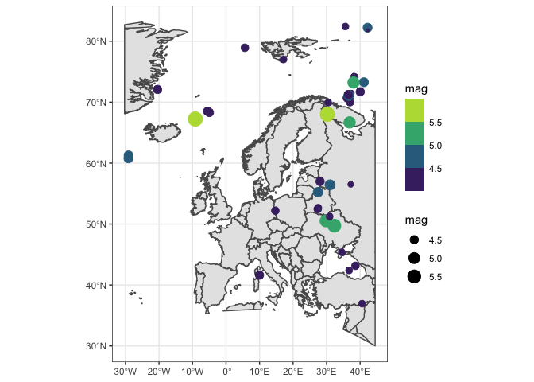

<!-- README.md is generated from README.Rmd. Please edit that file -->

Test with earthquakes:
======================

This repo is a test on how to update with github actions

The last tremor or earthquake happened 89 km ENE of Qapqal, China, and
had a magnitude of 4.4. The most intense tremor or earthquake in the
last month happened 152 km S of Al Ghayz̧ah, Yemen and had a magnitude of
5.3, this was updated at 05/01, 2022 21:26. Thanks stackoverflow!!
