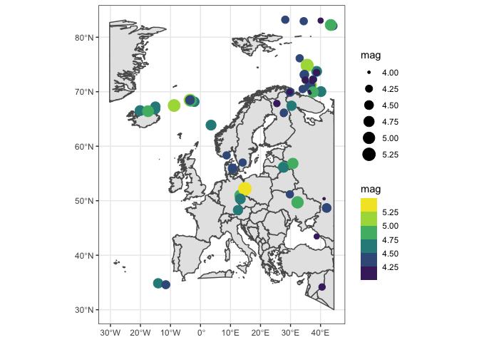

<!-- README.md is generated from README.Rmd. Please edit that file -->

Test with earthquakes:
======================

This repo is a test on how to update with github actions

The last tremor or earthquake happened 70 km WSW of Murghob, Tajikistan,
and had a magnitude of 4.7. The most intense tremor or earthquake in the
last month happened Mid-Indian Ridge and had a magnitude of 5.9, this
was updated at 03/10, 2021 10:22. Thanks stackoverflow!!
